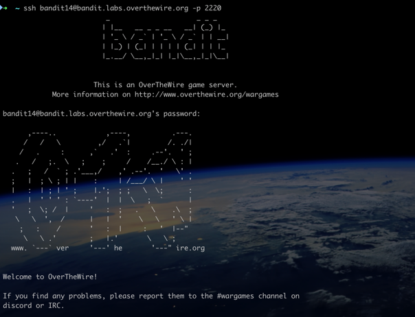

## Bandit

This repo contains the solution to Bandit challenges. Check [lint to competitions](https://overthewire.org/wargames/bandit/)

The Bandit wargame is aimed at absolute beginners. It will teach the basics needed to be able to play other wargames. If you notice something essential is missing or have ideas for new levels, please let us know!

- `netstat` - Basic networking tool for connecting, transferring files, and scanning ports. Displays open network sockets, routing tables, and a number of network interface (network interface controller or software-defined network interface) and network protocol statistics.
- 
- `socat` (short for "SOcket CAT") - more versatile and powerful tool compared to ncat (or netcat). Establish two bidirectional byte streams and transfers data between them. This tool used for networking and data transfer, capable of creating a wide range of communication channels
- `ncat` - more advanced version of nc, ncat is part of the Nmap project and adds features and improvements over the traditional netcat. Supports SSL/TLS for encrypted connections, Allows for various proxy types (HTTP, SOCKS, etc.), Listening with SSL
- `nc` - reading from and writing to network connections using TCP or UDP. Port Scanning, File Transfers, Creating Simple Servers

```bash
# Create a TCP server that echoes back received data:
socat TCP-LISTEN:1234,fork STDOUT
## Connect to created TCP server
telnet localhost 1234
openssl s_client 0.0.0.0:1234


# Forward TCP traffic from one port to another:
socat TCP-LISTEN:8080,fork TCP:localhost:80

# Create Port Proxy: Transfer a file over a TCP connection:

# receiver:
socat -v TCP-LISTEN:1234,fork FILE:received_file.txt

# sender:
socat FILE:some_file.txt TCP:localhost:1234
```

- `telnet` - used to communicate with remote devices over a TCP/IP network. Telnet does not support SSL/TLS encryption. It allows users to connect to remote servers and devices, primarily for remote management or accessing network services. Better (secure) alternative would be `ssh`.
```bash
# Connecting to a Host, or check if open
telnet localhost 22
```

- `openssl` - provides a variety of cryptographic operations and functionalities. SSL/TLS Management, Certificate Creation and Management, Key Generation, Data Encryption/Decryption and many more.





